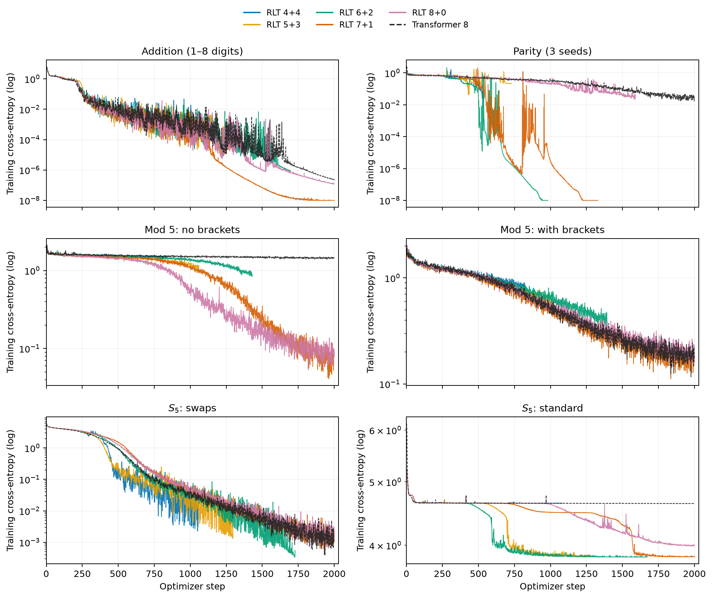
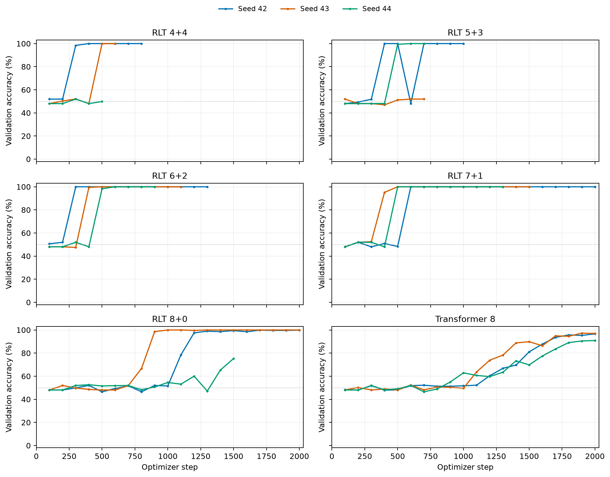

# Recurrent Looped Transformer

[](./Recurrent_Looped_Transformer.pdf)
[](https://yifanzhang-pro.github.io/recurrent-looped-tranformer/)

### Recurrent computation across prompt and response

**Recurrent Looped Transformer (RLT)** passes the decoder's final hidden state to the next token, together with that token's causal encoder representation.
The decoder reads encoder-derived global KV memory and maintains a sliding-window attention (SWA) cache at every layer.
The same update runs over prompt and response tokens.

**Authors:** [Yifan Zhang](https://yifzhang.com), Jichen Feng, Shihan Qin

**Report:** September 12, 2026 · **Updated:** September 15, 2026

[[Paper](./Recurrent_Looped_Transformer.pdf)] [[Project website](https://yifanzhang-pro.github.io/recurrent-looped-tranformer/)] [[Experiments](#depth-eight-experiments)]


## Architecture

For token $x_t$, let $e_t$ be its causal encoder representation and $M_{\le t}$ the encoder-derived global KV memory.
The decoder state includes both the recurrent output and layerwise SWA KV:

```math
H_t=(s_t,C_t^D),\qquad H_0=(s_\star,\varnothing).
```

```math
(s_t,C_t^D)=D_\phi\!\left(\mathrm{Merge}(e_t,s_{t-1});M_{\le t},C_{t-1}^D,t\right).
```

- **Global context:** encoder outputs are projected into cached KV; cross-attention reads positions up to the current token. With one memory group ($G=1$), all decoder layers read the same projected KV using their own queries.
- **Local memory:** each decoder layer projects its own SWA KV. A window of $W$ includes the current token and retains up to $W-1$ past entries for the next update.
- **Hidden-state feedback:** the previous final decoder output enters the next token's gated merge. The state continues across the prompt–response boundary.


[Architecture PDF](assets/architecture-detail.pdf)

After $t$ tokens, the recurrent path traverses $tL_D$ decoder blocks while the number of blocks evaluated per token stays fixed.
Compatible encoder and decoder attention and FFN weights can be shared; a tied 48+48 layout illustrates this option in the report.
The experiments below use untied eight-layer layouts.

### RLT without hidden-state feedback

**RLT w/o feedback** removes the previous-output feedback path, learned initial state, state normalization, gated merge, and feedback projection.
The decoder receives $z_t^0=e_t$ directly and retains global cross-attention and layerwise SWA.
Known tokens can run in parallel within each decoder layer during training and prefill; generation proceeds one token at a time.
The 4+4 control was implemented after this snapshot for future matched ablations and has no results in the tables below.


[Control architecture PDF](assets/architecture-no-feedback.pdf)

## Depth-eight experiments

The September 15, 2026 snapshot (16:11:47–16:12:10 UTC) compares **RLT 4+4, 5+3, 6+2, 7+1, 8+0 and Transformer 8** across six tasks.
Of 48 runs, 21 had reached the planned 2,000 optimizer steps; 27 were unfinished.
All results measure held-out validation accuracy at training lengths.

Models use width 512, FFN width 1,365, four attention heads, global batch 512 and the same AdamW schedule.
RLT uses SWA window 8, one shared encoder-memory group, feedback scale 0.1 and TBPTT 128, which covers every training sequence here.
RLT models have 26.10–28.73M parameters; Transformer 8 has 25.31M.
RLT 8+0 has no decoder blocks and still applies the recurrent merge.
Parity varies initialization seeds 42, 43 and 44 with the same training stream and validation set; other tasks use seed 42.

### Validation accuracy at shared checkpoints

Each row compares all six models at the latest step available for every required run within that task.
Values are percentages; parity is mean ± sample SD across all three initializations ($n=3$, ddof=1).
Addition requires a correct greedy answer and EOS; the other tasks use final-answer or final-state accuracy.

| Task | Step | RLT 4+4 | RLT 5+3 | RLT 6+2 | RLT 7+1 | RLT 8+0 | Transformer 8 |
| --- | ---: | ---: | ---: | ---: | ---: | ---: | ---: |
| Addition | 1000 | 100.00 | 98.44 | 100.00 | 100.00 | 100.00 | 100.00 |
| Parity | 500 | 83.29 ± 28.94 | 83.51 ± 28.00 | 99.44 ± 0.98 | 82.77 ± 29.84 | 48.70 ± 2.60 | 48.48 ± 0.53 |
| Mod-5, flat | 800 | 22.40 | 21.74 | 20.83 | 22.53 | 21.74 | 20.70 |
| Mod-5, brackets | 800 | 37.50 | 36.72 | 36.72 | 40.10 | 37.63 | 35.55 |
| S5, swaps | 1000 | 100.00 | 99.61 | 95.70 | 89.84 | 86.33 | 89.84 |
| S5, standard | 1000 | 1.17 | 3.52 | 1.95 | 1.56 | 1.17 | 1.17 |


Curves stop at available checkpoints.
Parity bands show mean ± sample SD across three seeds and are clipped to the accuracy range.
Vertical dotted lines mark the shared checkpoints in the table; standard S5 uses a narrower accuracy scale.

### Parity: learning speed and variability

At step 500, RLT 6+2 reaches **99.44 ± 0.98%**, compared with **48.48 ± 0.53%** for Transformer 8.
All three RLT 6+2 seeds reach 100% by step 600; Transformer 8 reaches 94.84 ± 3.43% at step 2,000.
RLT 4+4, 5+3 and 7+1 average about 83% at step 500, with SDs of 28–30 percentage points.


Every model has seen 256,000 training examples per seed and uses the same 768 validation examples.
Whiskers show sample SD and may extend beyond 100%.

### Completed mod-5 subset

At 2,000 steps, seed 42, these three models had completed both variants after 1,024,000 training examples per run.
Values are validation accuracy (%).

| Task | RLT 7+1 | RLT 8+0 | Transformer 8 |
| --- | ---: | ---: | ---: |
| Mod-5, flat | 95.44 | 90.89 | 20.57 |
| Mod-5, brackets | 78.26 | 75.52 | 79.56 |

The task generators differ in operator structure and label distribution; parentheses also occupy token positions.

### Training loss and individual parity runs



Training loss is measured before the optimizer update.
Parity averages all three seeds at common steps; other tasks use seed 42.
Values below 1e-8 are displayed at 1e-8 on the logarithmic axes.
Compare losses within each task, since supervision differs across tasks.



Individual curves continue to each run's last checkpoint, including steps beyond the end of the three-seed mean.
For example, RLT 5+3 seed 42 drops from 100% at step 500 to 48.05% at step 600 and recovers at step 700.

The preferred encoder–decoder split varies by task.
The comparisons change feedback, attention structure, parameter count and compute together; matched RLT w/o feedback runs will isolate hidden-state feedback.
Hardware throughput and RL performance remain to be measured.

[Experiment figures](assets/experiments-depth8/README.md)

## One execution across training and inference

| Mode | Encoder | Decoder and gradients |
| --- | --- | --- |
| Prompt prefill | Causal batch over known tokens | Recur through every prompt token and construct decoder SWA KV |
| Generation | Incremental encoding | Sample from the preceding state, then consume the token exactly once |
| Pretraining | Causal batch | Full BPTT; supervise every valid next-token target |
| SFT | Causal batch | Full BPTT; supervise assistant targets while updating state on all context tokens |
| Current-policy RL replay | Rebuild under current weights | Reconstruct the full history, including SWA caches; evaluate actions before consuming them |

Exact current-policy replay rebuilds parameter-dependent caches after weight updates.
Full gradients pass through recurrent outputs, decoder KV and encoder memory; detaching them changes the gradient.
The report specifies the sampling and replay distributions used for importance weighting.

## Independent community experiments

Synthetic state-tracking results contributed by [@AradhyeAgarwal](https://x.com/AradhyeAgarwal), using a small implementation with approximately **79K parameters** and **3 seeds**. Training length is **32 operations**; evaluation extends to **128 operations (4× the training length)**, with **2,048 test programs per task and length**.


Final-state accuracy by number of operations:

**Parity**

| Model | 16 operations | 32 operations (train length) | 64 operations (2×) | 128 operations (4×) |
| --- | ---: | ---: | ---: | ---: |
| RLT | ≈100% | ≈100% | ≈82% | 60.8% |
| Transformer | ≈98% | ≈72% | ≈50% | ≈48% |
| Token-only merge | ≈98% | ≈59% | ≈49% | ≈50% |

**Five-state transitions**

| Model | 16 operations | 32 operations (train length) | 64 operations (2×) | 128 operations (4×) |
| --- | ---: | ---: | ---: | ---: |
| RLT | ≈100% | ≈100% | ≈49% | 20.7% |
| Transformer | ≈54% | ≈24% | ≈20% | ≈21% |
| Token-only merge | ≈50% | ≈23% | ≈20% | ≈20% |

Values marked ≈ are approximate readings from the original figure; exact values are not labeled. RLT's 128-operation values are taken from the figure's numeric labels.

RLT fits both tasks at the training length, but accuracy declines on longer sequences. Chance accuracy is 50% for parity and 20% for five-state transitions. Points in the original figure show means across seeds; whiskers show seed minima and maxima. Parameter and data budgets were matched; FLOPs were not. These community results use a separate implementation and evaluation protocol from the depth-eight snapshot above.


## Resources

- [Updated paper](./Recurrent_Looped_Transformer.pdf)
- [Project website](https://yifanzhang-pro.github.io/recurrent-looped-tranformer/)
- [Experiment figures](assets/experiments-depth8/README.md)
- [Prefill–decode kernel mismatch note](https://github.com/yifanzhang-pro/Pretraining-RL-Science/blob/master/Prefill_Decode_Kernel_Mismatch.pdf)

## Citation

```bibtex
@techreport{zhang2026recurrentlooped,
  title  = {Recurrent Looped Transformer},
  author = {Zhang, Yifan and Feng, Jichen and Qin, Shihan},
  year   = {2026},
  month  = sep,
  url    = {https://github.com/yifanzhang-pro/recurrent-looped-tranformer}
}
```

## License

Copyright 2026 Yifan Zhang. Licensed under the [Apache License 2.0](./LICENSE).
