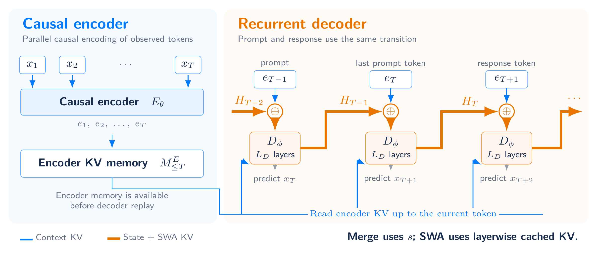
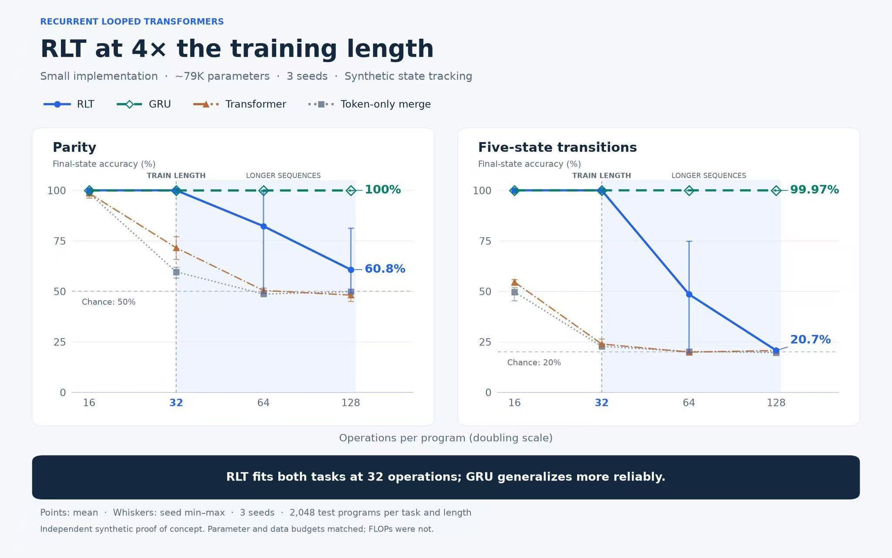

# Recurrent Looped Transformer

[](./Recurrent_Looped_Transformer.pdf)
[](https://yifanzhang-pro.github.io/recurrent-looped-tranformer/)

### Latent reasoning with infinite temporal depth

**Recurrent Looped Transformer (RLT)** carries latent computation across every prompt and response token. A causal encoder builds global key–value memory; a recurrent decoder combines that memory with sliding-window attention (SWA) and feedback from its previous final hidden state.

**Author:** [Yifan Zhang](https://yifzhang.com)  
**Date:** September 12, 2026

[[Paper](./Recurrent_Looped_Transformer.pdf)] [[Project Website](https://yifanzhang-pro.github.io/recurrent-looped-tranformer/)]

 

## Three design principles

1. **Latent reasoning with infinite temporal depth.** Each processed token extends a recurrent path through the decoder. With decoder depth $L_D$, the path traverses $tL_D$ blocks after $t$ tokens, while the number of blocks executed per token stays fixed.
2. **Model–hardware co-design.** Parallel causal encoder work, batching across independent sequences, memory reuse, and activation checkpointing expose opportunities for efficient training and inference around the recurrent decoder.
3. **Model–RL algorithm co-design.** Pretraining, SFT, sampling, and current-policy RL replay use the same complete-state transition, including prompt recurrence and decoder SWA caches.

“Infinite depth” means an extensible temporal computation path as the sequence grows, not infinite computation within one token. Reasoning improvements, hardware speedups, and RL scaling are research goals rather than measured results in this report.

## Architecture

For token $x_t$, let $e_t$ be its causal encoder representation and $M_{\le t}$ the encoder-derived global KV memory. The complete decoder state includes both the recurrent output and layerwise SWA KV:

```math
H_t=(s_t,C_t^D),\qquad H_0=(s_\star,\varnothing).
```

```math
(s_t,C_t^D)=D_\phi\!\left(\mathrm{Merge}(e_t,s_{t-1});M_{\le t},C_{t-1}^D,t\right).
```

```math
p_\Theta(x_{t+1}\mid x_{1:t})=\mathrm{softmax}\!\left(W_o\mathrm{RMSNorm}_o(s_t)\right)_{x_{t+1}}.
```

- **Global context:** cross-attention reads encoder memory only through the current position.
- **Local decoder memory:** SWA reads recent decoder KV and the current token's KV. A window of $W$ includes the current token; up to $W-1$ historical entries are retained for the next update.
- **Temporal feedback:** the previous final decoder output enters the next token's merge. Neither recurrent output nor SWA cache resets at the prompt–response boundary.

The concrete configuration uses **48 encoder layers + 48 decoder layers**, with compatible attention and FFN weights shared across stages. Decoder blocks additionally perform encoder-memory cross-attention, so equal layer counts do not imply equal FLOPs.

## One execution across training and inference

| Mode | Encoder | Decoder and gradients |
| --- | --- | --- |
| Prompt prefill | Causal batch over known tokens | Recur through every prompt token and construct all decoder SWA KV |
| Generation | Incremental encoding | Sample from the preceding state, then consume the token exactly once |
| Pretraining | Causal batch | Full BPTT; supervise every valid next-token target |
| SFT | Causal batch | Full BPTT; supervise assistant targets while updating state on all context tokens |
| Current-policy RL replay | Rebuild under current weights | Reconstruct the full history, including SWA caches; evaluate actions before consuming them |

Exact current-policy replay rebuilds parameter-dependent caches after weight updates. Full gradients pass through recurrent outputs, decoder KV, and encoder memory. Detaching any of these is a gradient approximation. Behavior log-probabilities must describe the actual sampling distribution; exact importance sampling also requires support coverage. Shared execution semantics remove structural prompt-boundary mismatch but do not alone guarantee numerical kernel parity or an unbiased off-policy objective.

## Preliminary synthetic experiments

Synthetic state-tracking results contributed by [@AradhyeAgarwal](https://x.com/AradhyeAgarwal), using a small implementation with approximately **79K parameters** and **3 seeds**. Training length is **32 operations**; evaluation extends to **128 operations (4× the training length)**, with **2,048 test programs per task and length**.



Final-state accuracy by number of operations:

**Parity**

| Model | 16 operations | 32 operations (train length) | 64 operations (2×) | 128 operations (4×) |
| --- | ---: | ---: | ---: | ---: |
| RLT | ≈100% | ≈100% | ≈82% | 60.8% |
| Transformer | ≈98% | ≈72% | ≈50% | ≈48% |
| Token-only merge | ≈98% | ≈59% | ≈49% | ≈50% |

**Five-state transitions**

| Model | 16 operations | 32 operations (train length) | 64 operations (2×) | 128 operations (4×) |
| --- | ---: | ---: | ---: | ---: |
| RLT | ≈100% | ≈100% | ≈49% | 20.7% |
| Transformer | ≈54% | ≈24% | ≈20% | ≈21% |
| Token-only merge | ≈50% | ≈23% | ≈20% | ≈20% |

Values marked ≈ are approximate readings from the original figure; exact values are not labeled. RLT's 128-operation values are taken from the figure's numeric labels.

RLT fits both tasks at the training length, but accuracy declines on longer sequences. Chance accuracy is 50% for parity and 20% for five-state transitions. Points in the original figure show means across seeds; whiskers show seed minima and maxima. Parameter and data budgets were matched; FLOPs were not. These are independent synthetic proof-of-concept results, not a validation of large-scale reasoning or RL scaling.

## Resources

- [Paper](./Recurrent_Looped_Transformer.pdf)
- [Project website](https://yifanzhang-pro.github.io/recurrent-looped-tranformer/)
- [Prefill–decode kernel mismatch note](https://github.com/yifanzhang-pro/Pretraining-RL-Science/blob/master/Prefill_Decode_Kernel_Mismatch.pdf)

## Citation

```bibtex
@techreport{zhang2026recurrentlooped,
  title  = {Recurrent Looped Transformer},
  author = {Zhang, Yifan},
  year   = {2026},
  month  = sep,
  url    = {https://github.com/yifanzhang-pro/recurrent-looped-tranformer}
}
```

## License

Copyright 2026 Yifan Zhang. Licensed under the [Apache License 2.0](./LICENSE).
