# Recurrent Looped Transformer

[](./Recurrent_Looped_Transformer.pdf)
[](https://yifanzhang-pro.github.io/recurrent-looped-tranformer/)

### Recurrent computation across prompt and response

**Recurrent Looped Transformer (RLT-1)** passes the decoder's final hidden state to the next token, together with that token's causal encoder representation.
The decoder reads encoder-derived global KV memory and maintains a sliding-window attention (SWA) cache at every layer.
The same update runs over prompt and response tokens.

**Authors:** [Yifan Zhang](https://yifzhang.com), Jichen Feng, Shihan Qin

**Report:** September 12, 2026 · **Updated:** September 20, 2026

[[Paper](./Recurrent_Looped_Transformer.pdf)] [[中文论文](./Recurrent_Looped_Transformer_ZH.pdf)] [[Project website](https://yifanzhang-pro.github.io/recurrent-looped-tranformer/)] [[Depth-eight results](#depth-eight-experiments)] [[Depth-sixteen results](#sixteen-layer-experiments)] [[Feedback variants](#mod-5-feedback-variants)]


## Architecture

For token $x_t$, let $e_t$ be its causal encoder representation and $M_{\le t}$ the encoder-derived global KV memory.
The decoder state includes both the recurrent output and layerwise SWA KV:

```math
H_t=(s_t,C_t^D),\qquad H_0=(s_\star,\varnothing).
```

```math
(s_t,C_t^D)=D_\phi\!\left(\mathrm{Merge}(e_t,s_{t-1});M_{\le t},C_{t-1}^D,t\right).
```

- **Global context:** encoder outputs are projected into cached KV; cross-attention reads positions up to the current token. With one memory group ($G=1$), all decoder layers read the same projected KV using their own queries.
- **Local memory:** each decoder layer projects its own SWA KV. A window of $W$ includes the current token and retains up to $W-1$ past entries for the next update.
- **Hidden-state feedback:** the previous final decoder output enters the next token's gated merge. The state continues across the prompt–response boundary.

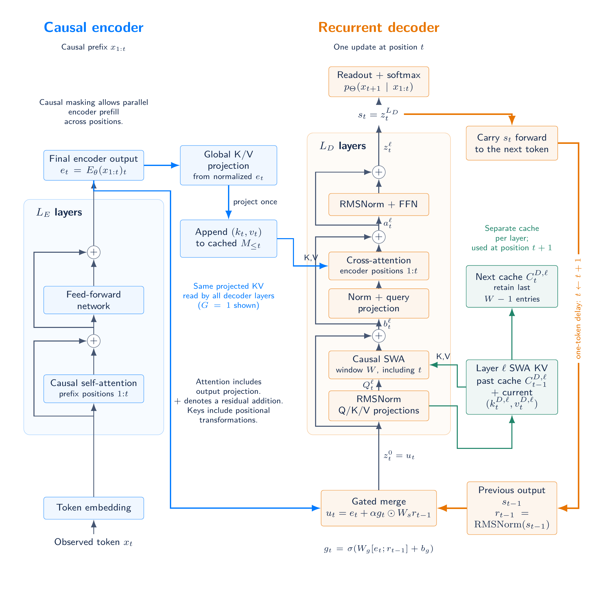

[Architecture PDF](assets/architecture-detail.pdf)

After $t$ tokens, the recurrent path traverses $tL_D$ decoder blocks while the number of blocks evaluated per token stays fixed.
Compatible encoder and decoder attention and FFN weights can be shared; a tied 48+48 layout illustrates this option in the report.
The experiments below use untied eight- and sixteen-layer layouts.

### RLT-0: no hidden-state feedback

**RLT-0** removes the previous-output feedback path, learned initial state, state normalization, gated merge, and feedback projection.
The decoder receives $z_t^0=e_t$ directly and retains global cross-attention and layerwise SWA.
Known tokens can run in parallel within each decoder layer during training and prefill; generation proceeds one token at a time.
The mod-5 experiments below evaluate RLT-0 at splits 4+4 through 8+0; it removes 787,968 feedback parameters per split.

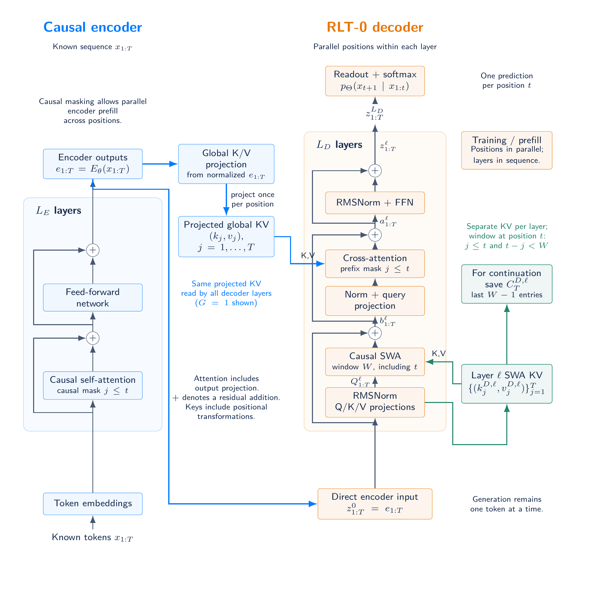

[Control architecture PDF](assets/architecture-no-feedback.pdf)

### RLT-2: chunk-level feedback

RLT-2 holds the feedback state fixed within a chunk and updates it from the last decoder output at a complete chunk boundary.
Known positions can run together within each decoder layer, using causal SWA and prefix-restricted encoder memory.
Chunk boundaries are anchored at BOS and continue across prompt, response and message boundaries; a partial chunk preserves the previous boundary state.
With chunk size B = 1, the equations recover RLT-1 at the same weights.
The mod-5 experiments below evaluate chunk sizes four and eight and report measured CPU training-step times.

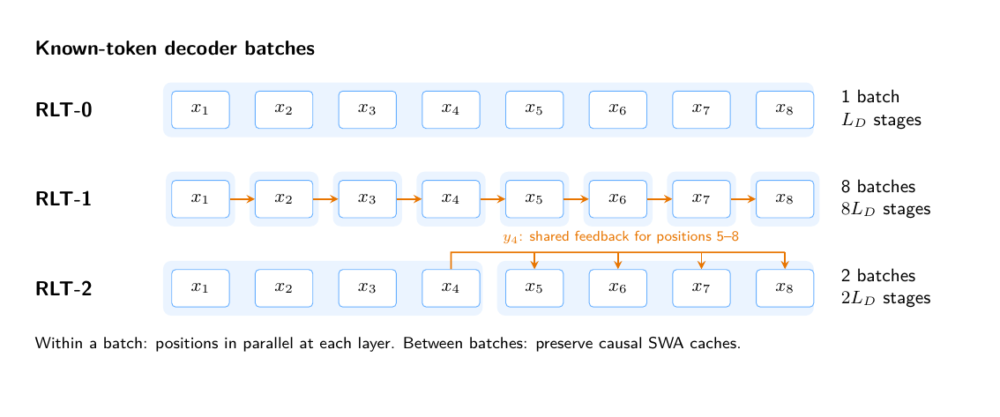

[Chunk architecture](assets/rlt2/architecture-chunk.png) · [Schedule PDF](assets/rlt2/chunk-schedule.pdf)

## Depth-eight experiments

The September 17, 2026 snapshot compares **RLT-1 4+4, 5+3, 6+2, 7+1, 8+0 and Transformer 8** on six algorithmic tasks.
All **108 runs** completed **2,000 optimizer steps**, using initialization seeds **42, 43 and 44 for every task**.
Training examples and held-out sets are fixed across initializations.
All aggregates report **mean ± sample standard deviation** (n = 3, ddof = 1).

Models use width 512, FFN width 1,365, four attention heads, global batch 512, microbatch 32 and the same AdamW schedule.
RLT-1 uses an SWA window of eight, one shared encoder-memory group, feedback scale 0.1 and TBPTT 128, which covers every training sequence and cuts no gradients here.
RLT-1 has 26.10–28.73M parameters; Transformer 8 has 25.31M.
The 8+0 variant has no decoder blocks but still applies the gated recurrent merge.

### Validation accuracy after 2,000 steps

Values are percentages, reported as mean ± sample SD across three initializations.
Each run has consumed 1,024,000 training examples.
Addition measures **teacher-forced answer-token accuracy**, including answer formatting and EOS, excluding prompt and padding positions.
Parity and mod-5 score the final label; S5 scores the final state.

| Task | RLT-1 4+4 | RLT-1 5+3 | RLT-1 6+2 | RLT-1 7+1 | RLT-1 8+0 | Transformer 8 |
| --- | ---: | ---: | ---: | ---: | ---: | ---: |
| Addition | 100.00±0.00 | 100.00±0.00 | 100.00±0.00 | 100.00±0.00 | 100.00±0.00 | 100.00±0.00 |
| Parity | 100.00±0.00 | 100.00±0.00 | 100.00±0.00 | 100.00±0.00 | 98.83±1.92 | 94.84±3.43 |
| Mod 5, no brackets | 45.36±46.43 | 94.18±7.29 | 69.62±33.01 | 70.01±43.15 | 60.33±35.70 | 64.02±37.64 |
| Mod 5, brackets | 70.53±10.75 | 74.35±6.71 | 74.87±3.72 | 74.78±3.01 | 75.17±6.78 | 73.87±9.07 |
| S5, swaps | 100.00±0.00 | 100.00±0.00 | 100.00±0.00 | 99.35±0.81 | 99.61±0.68 | 99.09±0.23 |
| S5, standard | 0.78±0.68 | 2.47±1.26 | 2.21±1.48 | 2.08±0.98 | 1.82±1.19 | 0.52±0.23 |

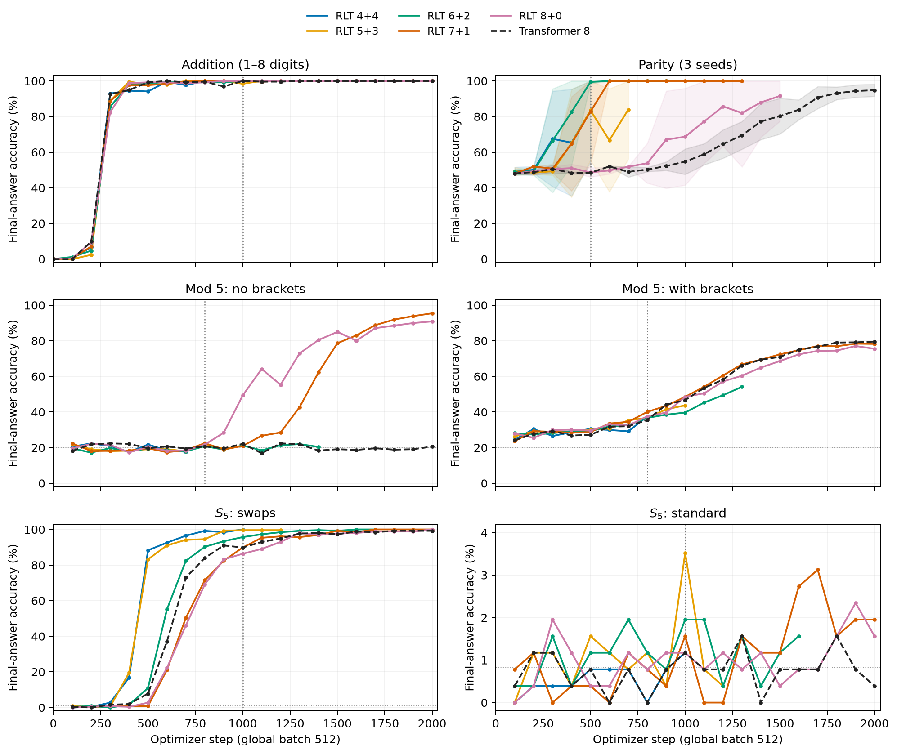

All curves extend through step 2,000. Bands show sample SD, clipped to the accuracy range. Standard S5 uses a narrower vertical scale.
[PDF](assets/experiments-depth8/validation-curves.pdf)

### Learning speed and initialization

At step 500, RLT-1 6+2 reaches **99.44 ± 0.98%** parity accuracy, compared with **48.48 ± 0.53%** for Transformer 8.
All three 6+2 seeds reach 100% by step 600.
At step 2,000, splits 4+4 through 7+1 reach 100% in all three seeds, while Transformer 8 reaches 94.84 ± 3.43%.

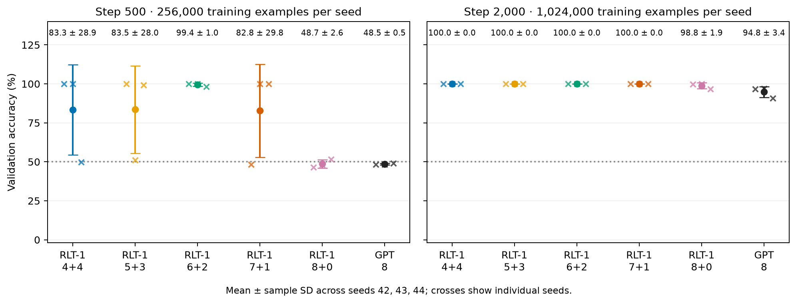

Both panels use the same 768 validation examples. They correspond to 256,000 and 1,024,000 training examples per seed. SD whiskers can extend beyond 100%.
[PDF](assets/experiments-depth8/parity-errorbars.pdf)

Flat mod-5 varies strongly with initialization: RLT-1 5+3 reaches **94.18 ± 7.29%**, compared with **64.02 ± 37.64%** for Transformer 8.
The three 4+4 seeds score 17.58%, 19.53% and 98.96%.
Bracketed mod-5 model means are closer, spanning 70.53–75.17% for RLT-1 versus 73.87 ± 9.07% for the Transformer.
The generators differ in operator structure and label distribution; parentheses also occupy token positions.

### Length generalization

Each run selects its lowest in-distribution validation-loss checkpoint over the full training history, taking the earliest step on ties.
Test results do not enter selection.
At every task and length, all models and seeds receive the same 256 addition pairs or 1,024 formal-task sequences.
The evaluation covers **846 model–seed–length combinations**, summarized as 282 three-seed means and sample SDs.

- **Parity:** 5+3 and 7+1 retain **100% accuracy at 256 bits in every seed**; Transformer 8 reaches 50.07 ± 1.63%.
- **Swaps-S5:** at 512 operations, 4+4 reaches **55.70 ± 25.78% final-state accuracy** and **91.16 ± 6.09% prefix-token accuracy**, versus 0.85 ± 0.30% and 9.33 ± 0.11% for Transformer 8.
- **Addition:** 7+1 reaches 68.05 ± 3.64% teacher-forced token accuracy at nine digits per operand. At 32 digits, all model means fall to 14.89–16.84%.
- **Modular arithmetic:** flat mod-5 approaches its 20% uniform reference at length 255; bracketed mod-5 also loses accuracy at longer lengths.

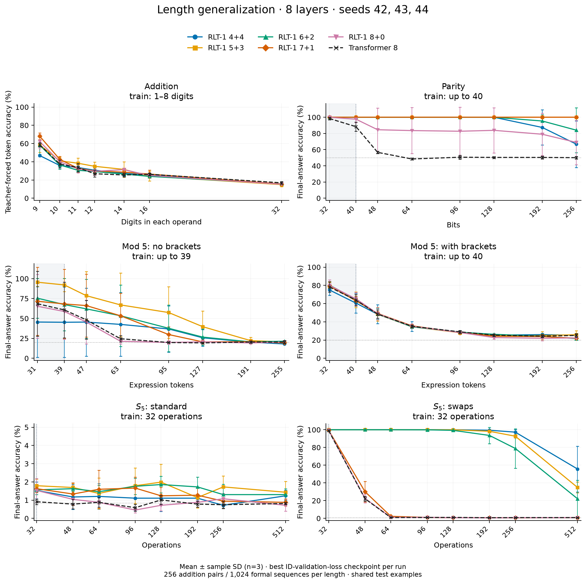

Gray regions mark training lengths. Addition uses teacher-forced answer tokens; other tasks use final labels or states. Error bars show sample SD across initialization seeds.
[PDF](assets/experiments-depth8/generalization-depth08-primary.pdf)

#### Accuracy at the longest tested length

All entries are percentages, mean ± sample SD across three initializations.
Addition lengths count digits per operand; formal-task lengths count input symbols or operations, excluding boundary markers.

| Task (test length) | RLT-1 4+4 | RLT-1 5+3 | RLT-1 6+2 | RLT-1 7+1 | RLT-1 8+0 | Transformer 8 |
| --- | ---: | ---: | ---: | ---: | ---: | ---: |
| Addition (32) | 15.30±0.44 | 14.89±2.27 | 15.74±1.58 | 15.59±1.57 | 15.31±0.93 | 16.84±1.45 |
| Parity (256) | 66.76±28.78 | 100.00±0.00 | 84.05±27.63 | 100.00±0.00 | 68.91±27.39 | 50.07±1.63 |
| Mod 5, no brackets (255) | 18.00±0.39 | 20.57±0.62 | 21.42±0.49 | 19.34±0.54 | 20.44±0.91 | 20.35±2.01 |
| Mod 5, brackets (256) | 25.20±1.71 | 25.81±4.34 | 21.58±1.86 | 22.04±1.72 | 22.30±1.13 | 25.07±2.05 |
| S5, standard (512) | 1.24±0.30 | 1.43±0.60 | 1.30±0.31 | 0.88±0.20 | 0.72±0.31 | 0.81±0.06 |
| S5, swaps (512) | 55.70±25.78 | 34.86±6.10 | 22.14±20.95 | 0.85±0.06 | 0.85±0.20 | 0.85±0.30 |

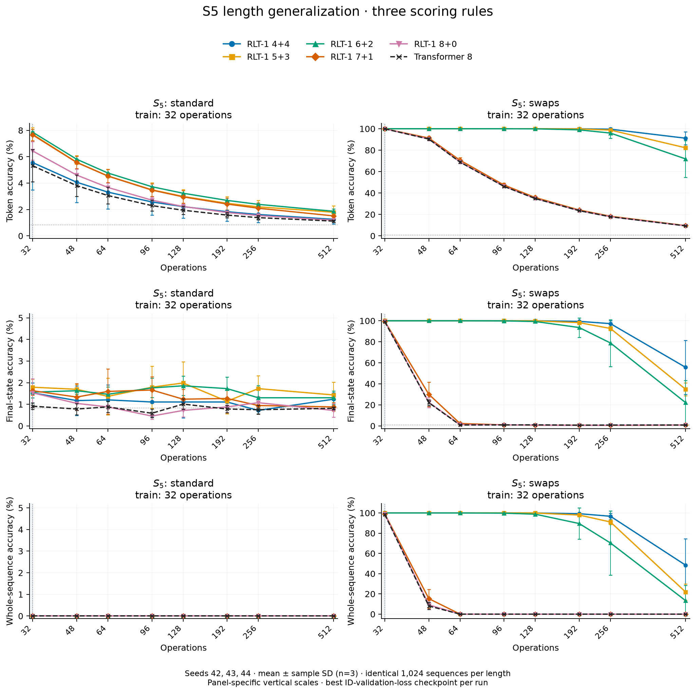

Whole-sequence accuracy requires every prefix prediction to be correct. Every model uses the same 1,024 sequences at each length. Each panel labels its vertical scale.
[PDF](assets/experiments-depth8/generalization-depth08-s5-metrics.pdf)

The preferred encoder–decoder split depends on the task.
These depth-eight comparisons change feedback, attention structure, parameter count and compute together.
The separate mod-5 study below compares RLT-0, RLT-1 and RLT-2 at each split, with parameter counts and training-step times reported.

### Supplementary results

[Training loss](assets/experiments-depth8/training-loss.png), [individual parity seeds](assets/experiments-depth8/parity-individual-seeds.png), [fixed-length token accuracy](assets/experiments-depth8/validation-token-accuracy.png), and [token-level length generalization](assets/experiments-depth8/generalization-depth08-token-accuracy.png) provide additional diagnostics.
Training loss is unsmoothed and measured before the optimizer update; all six tasks use three seeds.

[Depth-eight experiment figures and protocol](assets/experiments-depth8/README.md)

## Sixteen-layer experiments

The September 20, 2026 snapshot adds addition and parity results for **RLT-1 8+8 through 16+0 and Transformer 16**, using **seed 42**.
All models use width 512, FFN width 1,365, four heads and microbatch 32. These are untied layouts.
Checkpoints minimize in-distribution validation loss, with earliest-step tie breaking; test results do not select checkpoints.

### Addition

All ten runs completed **2,000 steps**, using mixed 1–8-digit training data and global batch 512. Every model selects step 2,000.
Teacher-forced answer-token accuracy includes answer formatting and EOS; each test width uses the same 256 operand pairs as the eight-layer study.
RLT-1 has 51.27–56.00M parameters; Transformer 16 has 50.49M.

Transformer 16 leads all nine RLT-1 splits at widths nine through twelve. At nine digits, it reaches **84.51%**, versus **47.32–71.10%** for RLT-1.
At 32 digits, all ten models fall to **14.73–16.62%**.
RLT-1 8+8 reaches 55.72% at nine digits, compared with 47.17% for 4+4 in the seed-42 depth-eight run.

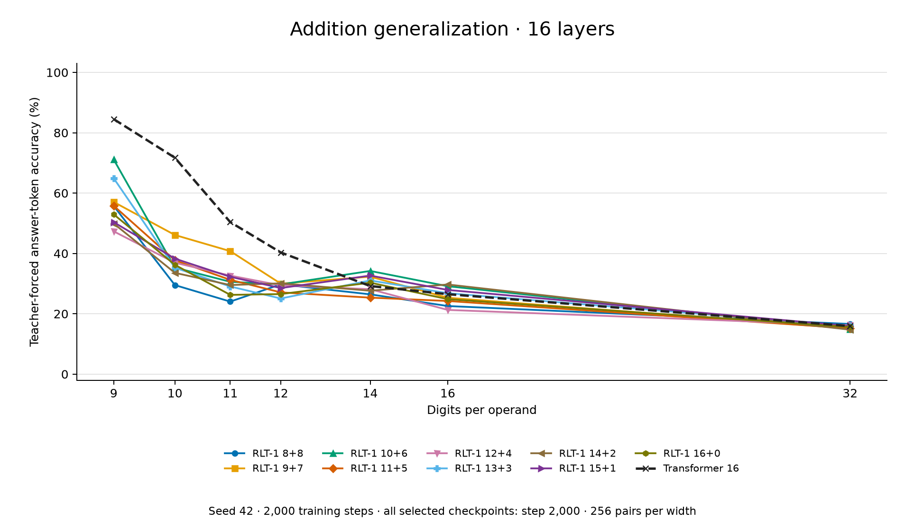

[4+4 versus 8+8 comparison](assets/results-refresh-20260920/arithmetic-generalization-rlt44-vs88.png) · [Vector figure](assets/results-refresh-20260920/arithmetic-generalization-depth16-series.svg)

### Parity

Parity training uses lengths 3–40, global batch 1,024 and a 2,000-step budget. Nine runs completed training.
The ongoing 8+8 run selects step 1,400 from a history through step 1,800; the completed 9+7 run selects step 1,300.
Each test length has 1,024 shared examples.
**8+8, 9+7, 11+5 and 16+0 retain 100% accuracy at 256 bits**, compared with **49.41%** for Transformer 16.

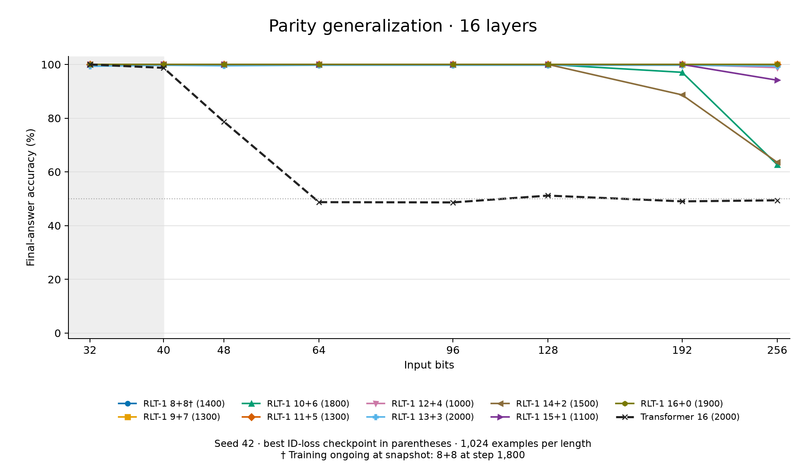

Accuracies below are percentages from one initialization seed. Addition uses answer-token accuracy at step 2,000; parity scores the final answer at the listed checkpoint.
† marks ongoing parity training; all addition runs are complete.

| Model | Addition: 9 digits | Addition: 32 digits | Parity checkpoint | Parity: 256 bits |
| --- | ---: | ---: | ---: | ---: |
| RLT-1 8+8 † | 55.72 | 16.62 | 1,400 | 100.00 |
| RLT-1 9+7 | 57.04 | 15.07 | 1,300 | 100.00 |
| RLT-1 10+6 | 71.10 | 14.88 | 1,800 | 62.70 |
| RLT-1 11+5 | 55.78 | 15.18 | 1,300 | 100.00 |
| RLT-1 12+4 | 47.32 | 16.21 | 1,000 | 98.83 |
| RLT-1 13+3 | 64.91 | 15.93 | 2,000 | 99.41 |
| RLT-1 14+2 | 49.90 | 14.73 | 1,500 | 63.57 |
| RLT-1 15+1 | 50.36 | 15.92 | 1,100 | 94.14 |
| RLT-1 16+0 | 52.94 | 15.60 | 1,900 | 100.00 |
| Transformer 16 | 84.51 | 15.92 | 2,000 | 49.41 |

## Mod-5 feedback variants

The September 20 snapshot compares **RLT-1, RLT-0 and RLT-2 with chunk sizes four and eight**, at splits 4+4 through 8+0, plus Transformer 8.
All runs use seed 42, width 512, FFN width 1,365, four heads, global batch 512, microbatch 32, four CPU threads and FP32.
The 5,000-step schedule includes 200 warmup updates and cosine decay from 0.0001 to 0.000005.
RLT-1 and RLT-2 use TBPTT 128, which covers every training sequence; RLT-0 uses full BPTT and removes 787,968 feedback parameters per split.

**40 of 42 runs completed 5,000 steps**, contributing 360 model–length test points.
RLT-1 4+4 remains ongoing at 4,300 steps without brackets and 4,900 with brackets.
Validation curves include these unfinished runs; length-generalization curves use completed runs' best ID-loss checkpoints and 1,024 shared examples per length.
All results use one seed, so the figures have no across-seed error bars.

- **Flat mod-5:** at length 63, RLT-1 7+1 reaches **99.61%**, versus 18.95% for chunk4, 43.75% for chunk8 and 18.85% for RLT-0 at the same split; Transformer 8 reaches 34.96%. Chunk4 4+4 reaches 92.68% at this length.
- **Longer flat sequences:** RLT-1 6+2 retains **74.71% at length 127**. All completed models approach 20% chance accuracy at length 255.
- **Bracketed mod-5:** at length 64, RLT-1 5+3 reaches **71.09%**, compared with 66.31% for chunk4 4+4 and 47.46% for Transformer 8.

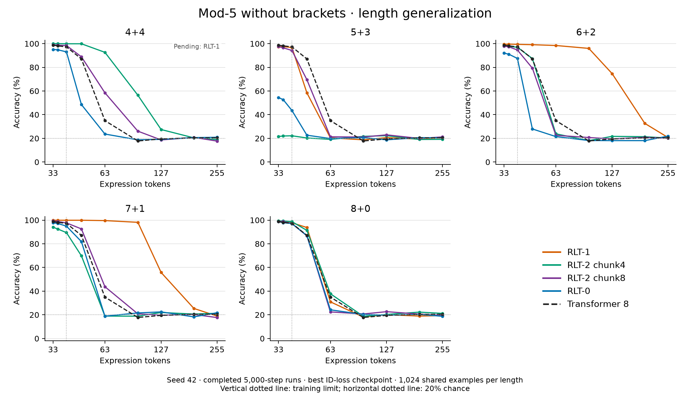

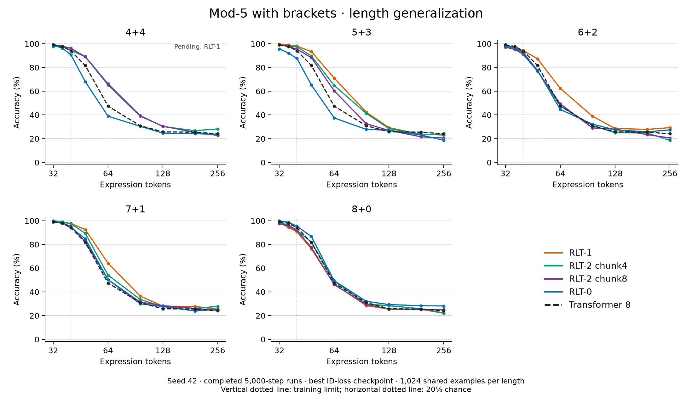

Vertical dotted lines mark the training limit; horizontal dotted lines mark 20% chance accuracy.
[Flat validation curves](assets/results-refresh-20260920/mod5-no-brackets-validation.png) · [Bracketed validation curves](assets/results-refresh-20260920/mod5-with-brackets-validation.png)

### CPU training-step time

The recorded 4+4 step times average steps **1,001–2,000**, excluding validation, checkpoint writes and logging.
These measurements use four CPU threads and FP32 on a shared cluster; node load varies.

| Model (4+4) | Flat mod-5: seconds/step | Bracketed mod-5: seconds/step |
| --- | ---: | ---: |
| RLT-1 | 62.59 | 54.09 |
| RLT-2 chunk4 | 27.52 | 23.81 |
| RLT-2 chunk8 | 18.55 | 17.33 |
| RLT-0 | 14.54 | 12.98 |

Relative to RLT-1, chunk4 steps are **2.27×** as fast, chunk8 steps **3.12–3.37×**, and RLT-0 steps **4.17–4.30×** across the two tasks.
These measurements cover training steps; they do not measure GPU throughput, inference speed or RL performance.

[Figures and experimental protocol](assets/results-refresh-20260920/README.md) · [Source data and checkpoint records](https://github.com/yifanzhang-pro/Recurrent-Looped-Transformer-Overleaf/tree/f3102f63b905235ed228e6dfaa58c96fa71d8c81/data/results-refresh-20260919)

## One execution across training and inference

| Mode | Encoder | Decoder and gradients |
| --- | --- | --- |
| Prompt prefill | Causal batch over known tokens | Recur through every prompt token and construct decoder SWA KV |
| Generation | Incremental encoding | Sample from the preceding state, then consume the token exactly once |
| Pretraining | Causal batch | Full BPTT; supervise every valid next-token target |
| SFT | Causal batch | Full BPTT; supervise assistant targets while updating state on all context tokens |
| Current-policy RL replay | Rebuild under current weights | Reconstruct the full history, including SWA caches; evaluate actions before consuming them |

Exact current-policy replay rebuilds parameter-dependent caches after weight updates.
Full gradients pass through recurrent outputs, decoder KV and encoder memory; detaching them changes the gradient.
The report specifies the sampling and replay distributions used for importance weighting.

## Independent community experiments

Synthetic state-tracking results contributed by [@AradhyeAgarwal](https://x.com/AradhyeAgarwal), using a small implementation with approximately **79K parameters** and **3 seeds**. Training length is **32 operations**; evaluation extends to **128 operations (4× the training length)**, with **2,048 test programs per task and length**.


Final-state accuracy by number of operations:

**Parity**

| Model | 16 operations | 32 operations (train length) | 64 operations (2×) | 128 operations (4×) |
| --- | ---: | ---: | ---: | ---: |
| RLT | ≈100% | ≈100% | ≈82% | 60.8% |
| Transformer | ≈98% | ≈72% | ≈50% | ≈48% |
| Token-only merge | ≈98% | ≈59% | ≈49% | ≈50% |

**Five-state transitions**

| Model | 16 operations | 32 operations (train length) | 64 operations (2×) | 128 operations (4×) |
| --- | ---: | ---: | ---: | ---: |
| RLT | ≈100% | ≈100% | ≈49% | 20.7% |
| Transformer | ≈54% | ≈24% | ≈20% | ≈21% |
| Token-only merge | ≈50% | ≈23% | ≈20% | ≈20% |

Values marked ≈ are approximate readings from the original figure; exact values are not labeled. RLT's 128-operation values are taken from the figure's numeric labels.

RLT fits both tasks at the training length, but accuracy declines on longer sequences. Chance accuracy is 50% for parity and 20% for five-state transitions. Points in the original figure show means across seeds; whiskers show seed minima and maxima. Parameter and data budgets were matched; FLOPs were not. These community results use a separate implementation and evaluation protocol from the depth-eight snapshot above.


## Resources

- [Updated paper](./Recurrent_Looped_Transformer.pdf)
- [中文论文](./Recurrent_Looped_Transformer_ZH.pdf)
- [Project website](https://yifanzhang-pro.github.io/recurrent-looped-tranformer/)
- [Depth-eight experiment figures](assets/experiments-depth8/README.md)
- [Sixteen-layer and feedback-variant figures](assets/results-refresh-20260920/README.md)
- [Presentation slides](https://yifzhang.com/slides-rlt/)
- [Prefill–decode kernel mismatch note](https://github.com/yifanzhang-pro/Pretraining-RL-Science/blob/master/Prefill_Decode_Kernel_Mismatch.pdf)

## Citation

```bibtex
@techreport{zhang2026recurrentlooped,
  title  = {Recurrent Looped Transformer},
  author = {Zhang, Yifan and Feng, Jichen and Qin, Shihan},
  year   = {2026},
  month  = sep,
  url    = {https://github.com/yifanzhang-pro/recurrent-looped-tranformer}
}
```

## License

Copyright 2026 Yifan Zhang. Licensed under the [Apache License 2.0](./LICENSE).
